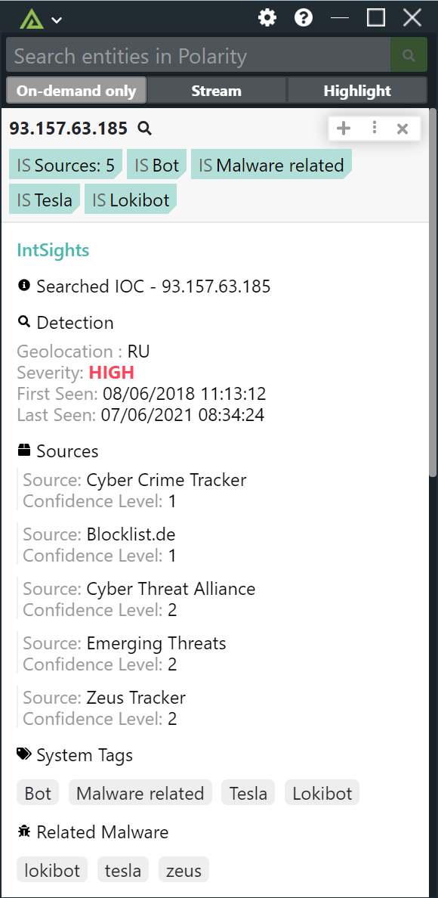

# Polarity IntSights Integration

The IntSights ETP Suite monitors thousands of sources across the clear, deep, and dark web to identify threats that directly target your unique digital footprint. IntSights Threat Command finds and mitigates external threats that directly target your organization, employees, and customers.

To learn more about IntSights, please visit: https://intsights.com/products/threat-command

## IntSights Integration Options

### IntSights Username
A Valid IntSights API Username

### IntSights Password
A Valid IntSights API Password

## Installation Instructions

Installation instructions for integrations are provided on the [PolarityIO GitHub Page](https://polarityio.github.io/).

## Polarity

Polarity is a memory-augmentation platform that improves and accelerates analyst decision making.  For more information about the Polarity platform please see:

https://polarity.io/

